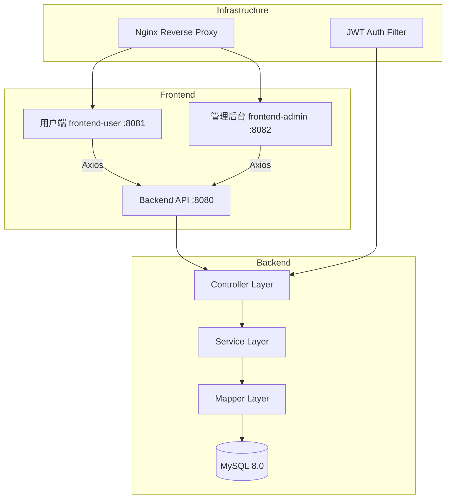
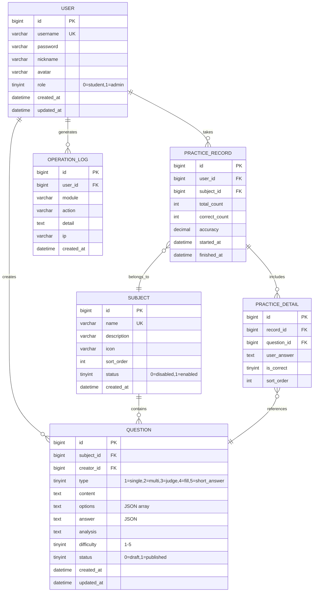

# 题库练习网站 - 项目设计文档

## 1. 系统架构

## 2. ER 图

## 3. 接口清单

### AuthController `/api/auth`
| Method | Path | Description |
|--------|------|-------------|
| POST | /login | 用户登录 |
| POST | /register | 用户注册 |
| GET | /me | 获取当前用户信息 |

### SubjectController `/api/subjects`
| Method | Path | Description |
|--------|------|-------------|
| GET | / | 获取科目列表 |
| POST | / | 创建科目 (admin) |
| PUT | /{id} | 更新科目 (admin) |
| DELETE | /{id} | 删除科目 (admin) |

### QuestionController `/api/questions`
| Method | Path | Description |
|--------|------|-------------|
| GET | / | 分页查询题目 |
| GET | /{id} | 获取题目详情 |
| POST | / | 创建题目 |
| PUT | /{id} | 更新题目 |
| DELETE | /{id} | 删除题目 |
| GET | /practice | 获取练习题目列表 |

### PracticeController `/api/practices`
| Method | Path | Description |
|--------|------|-------------|
| POST | /start | 开始练习 |
| POST | /submit | 提交练习 |
| GET | /records | 获取练习记录 |
| GET | /records/{id} | 获取练习详情 |
| GET | /stats | 获取统计数据 |
| GET | /stats/subject | 按科目统计正确率 |

### UserController `/api/users` (admin)
| Method | Path | Description |
|--------|------|-------------|
| GET | / | 分页查询用户 |
| PUT | /{id}/status | 启用/禁用用户 |
| DELETE | /{id} | 删除用户 |

### LogController `/api/logs` (admin)
| Method | Path | Description |
|--------|------|-------------|
| GET | / | 分页查询操作日志 |

## 4. UI/UX 规范

- **主色调**: `#4F46E5` (Indigo-600)
- **辅助色**: `#10B981` (Emerald-500) 用于正确/成功
- **警告色**: `#EF4444` (Red-500) 用于错误/失败
- **背景色**: `#F8FAFC` (Slate-50)
- **卡片背景**: `#FFFFFF`
- **文字主色**: `#1E293B` (Slate-800)
- **文字次色**: `#64748B` (Slate-500)
- **字体**: `Inter, -apple-system, sans-serif`
- **圆角**: 卡片 `12px`, 按钮 `8px`, 输入框 `8px`
- **阴影**: `0 1px 3px rgba(0,0,0,0.1), 0 1px 2px rgba(0,0,0,0.06)`
- **间距系统**: 4px / 8px / 12px / 16px / 24px / 32px / 48px
